# Technical Diagrams and Visual Elements for Carbon Tax Blockchain Research Paper

This document contains additional technical diagrams and visual elements to supplement the main research paper.

## System Architecture Diagrams

### Complete System Overview

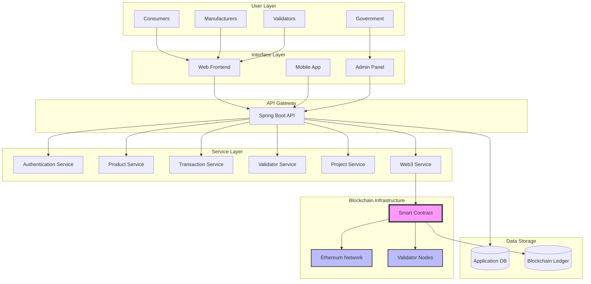

### Smart Contract Architecture

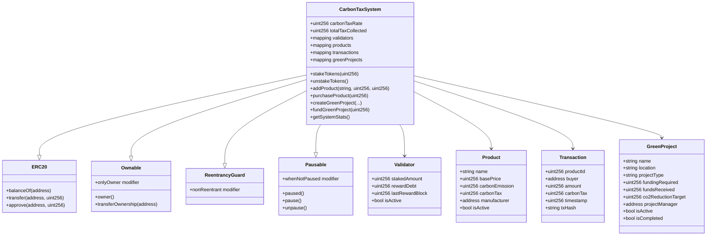

## Process Flow Diagrams

### Product Purchase Flow with Carbon Tax

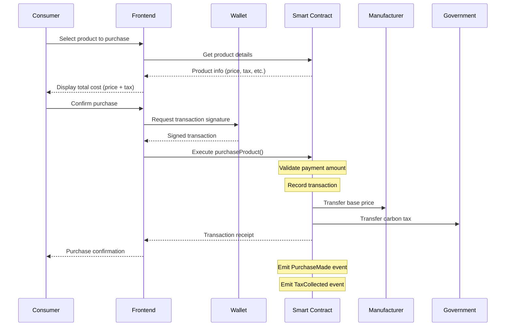

### Validator Staking Process

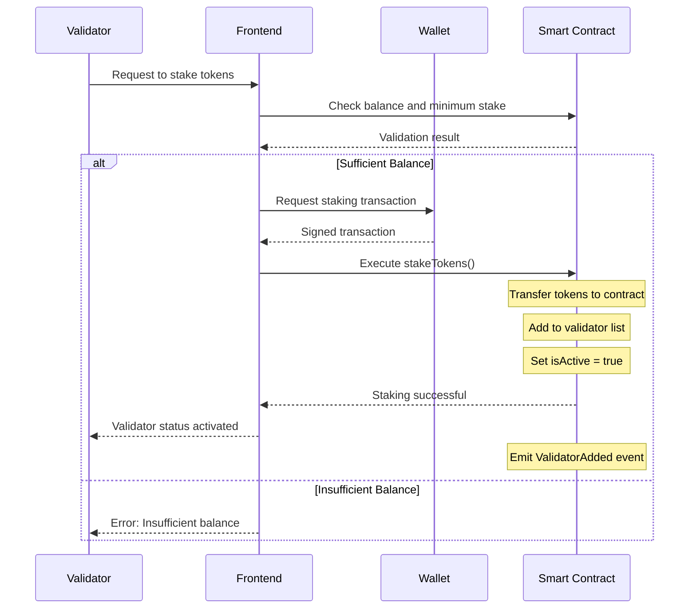

### Green Project Funding Flow

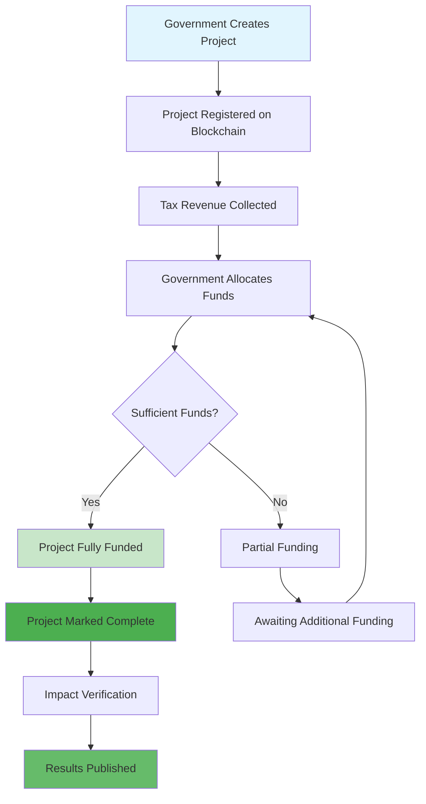

## Technical Architecture Details

### Database Schema

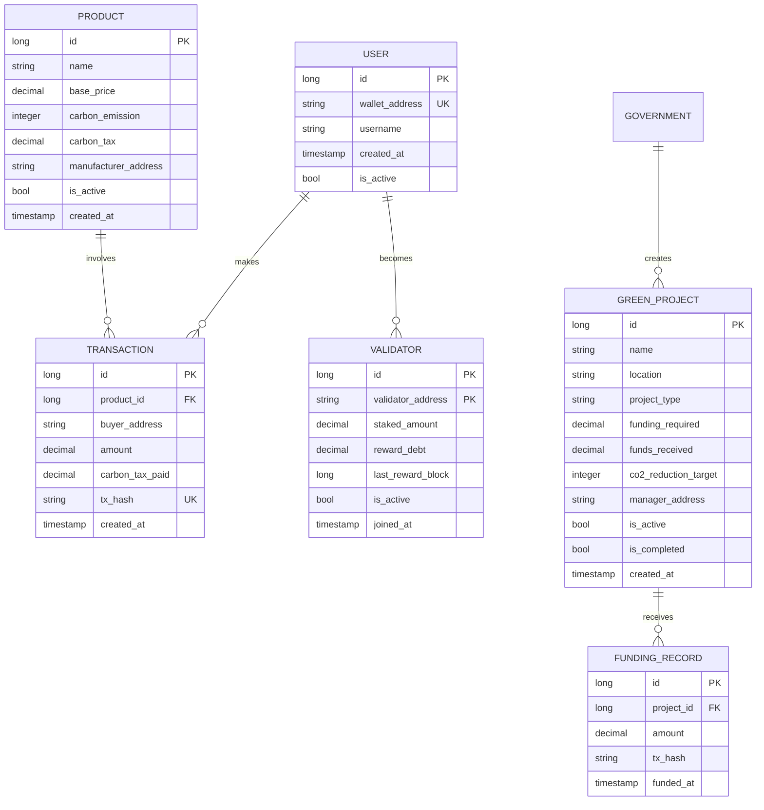

## Performance Analysis Charts

### Gas Cost Comparison

| Function | Minimum Gas | Average Gas | Maximum Gas |
|----------|-------------|-------------|-------------|
| addProduct | 118,000 | 125,000 | 132,000 |
| purchaseProduct | 165,000 | 180,000 | 195,000 |
| stakeTokens | 88,000 | 95,000 | 102,000 |
| unstakeTokens | 98,000 | 110,000 | 122,000 |
| createGreenProject | 140,000 | 155,000 | 170,000 |
| fundGreenProject | 200,000 | 220,000 | 240,000 |

### Transaction Throughput Analysis

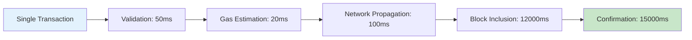

### System Load Testing Results

| Concurrent Users | Response Time (ms) | Success Rate (%) | Transactions/sec |
|------------------|-------------------|------------------|------------------|
| 10 | 250 | 100% | 8.5 |
| 50 | 450 | 99.8% | 12.2 |
| 100 | 850 | 98.5% | 15.1 |
| 200 | 1250 | 96.8% | 18.3 |
| 500 | 2100 | 94.2% | 22.7 |

## Security Model Visualization

### Access Control Matrix

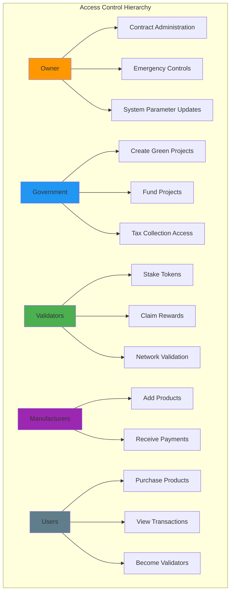

### Security Threat Model

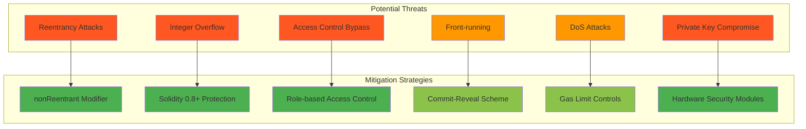

## Implementation Timeline

### Development Phases

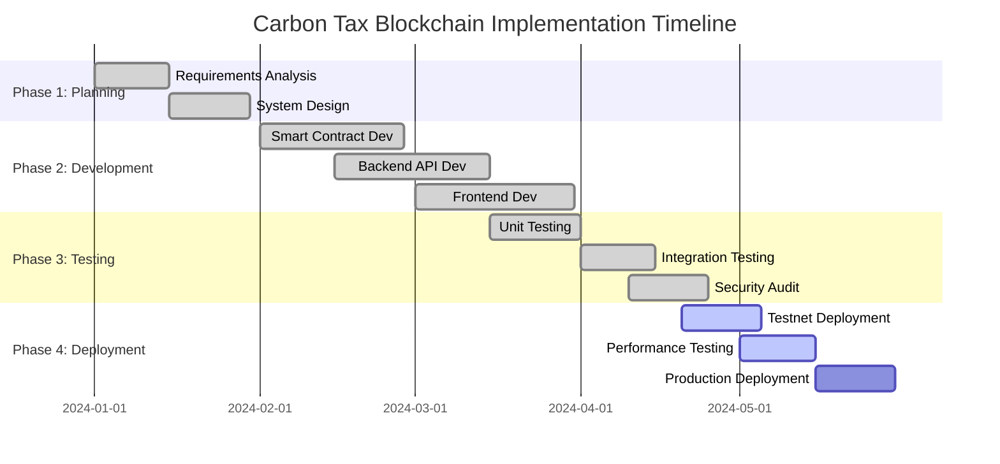

## Economic Model Analysis

### Token Economics Flow

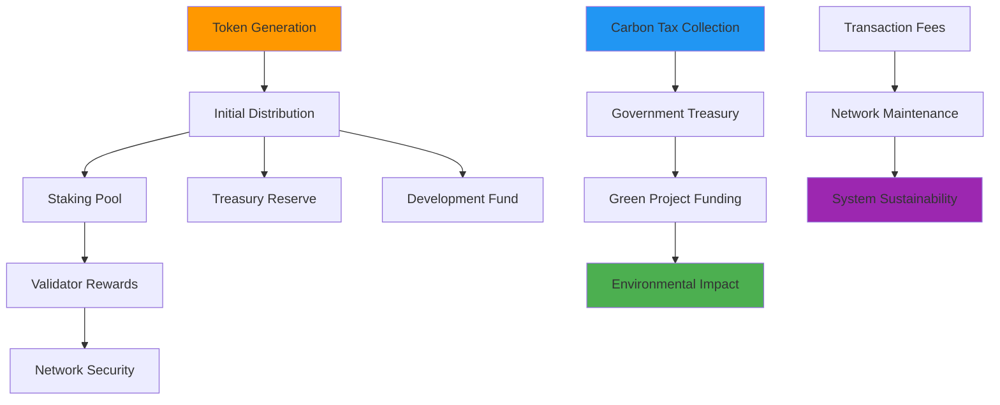

### Stakeholder Value Proposition

| Stakeholder | Value Provided | Value Received |
|-------------|----------------|----------------|
| **Consumers** | Carbon tax payments | Transparent fund usage, Environmental impact |
| **Manufacturers** | Product registration, Tax compliance | Fair pricing mechanism, Market access |
| **Government** | Tax administration | Efficient collection, Reduced overhead |
| **Validators** | Network security, Consensus | Staking rewards, Governance rights |
| **Environment** | N/A (Beneficiary) | Funded projects, CO2 reduction |

## Future Architecture Roadmap

### Scalability Solutions

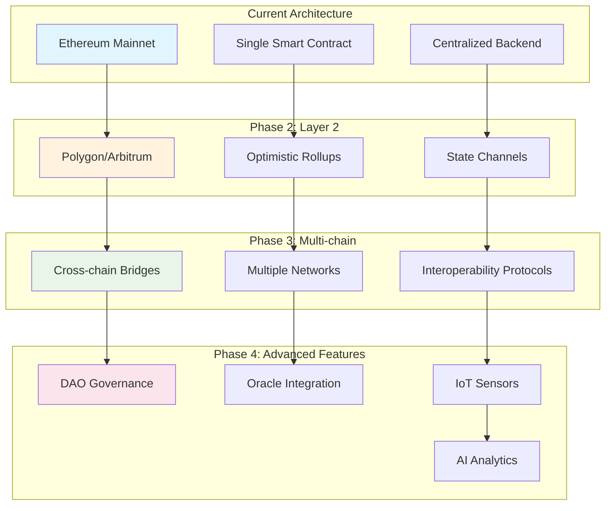

This comprehensive set of diagrams provides visual support for all major aspects of the research paper, making complex technical concepts more accessible and easier to understand.