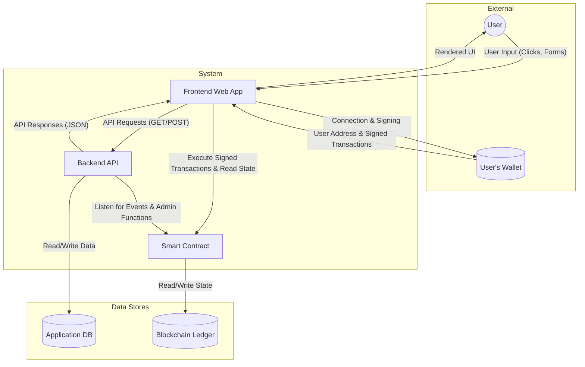

```mermaid
graph TD
    subgraph External
        User((User))
        UserWallet[("User's Wallet")]
    end

    subgraph System
        Frontend["Frontend Web App"]
        Backend["Backend API"]
        SmartContract["Smart Contract"]
    end

    subgraph Data Stores
        AppDB[("Application DB")]
        Blockchain[("Blockchain Ledger")]
    end

    %% User -> Frontend
    User -- "User Input (Clicks, Forms)" --> Frontend
    Frontend -- "Rendered UI" --> User

    %% Frontend -> Wallet
    Frontend -- "Connection & Signing Requests" --> UserWallet
    UserWallet -- "User Address & Signed Transactions" --> Frontend

    %% Frontend -> Backend
    Frontend -- "API Requests (GET/POST)" --> Backend
    Backend -- "API Responses (JSON)" --> Frontend

    %% Backend -> DB
    Backend -- "Read/Write Data" --> AppDB

    %% Frontend -> Smart Contract
    Frontend -- "Execute Signed Transactions & Read State" --> SmartContract

    %% Backend -> Smart Contract
    Backend -- "Listen for Events & Admin Functions" --> SmartContract

    %% Smart Contract -> Blockchain
    SmartContract -- "Read/Write State" --> Blockchain
```
