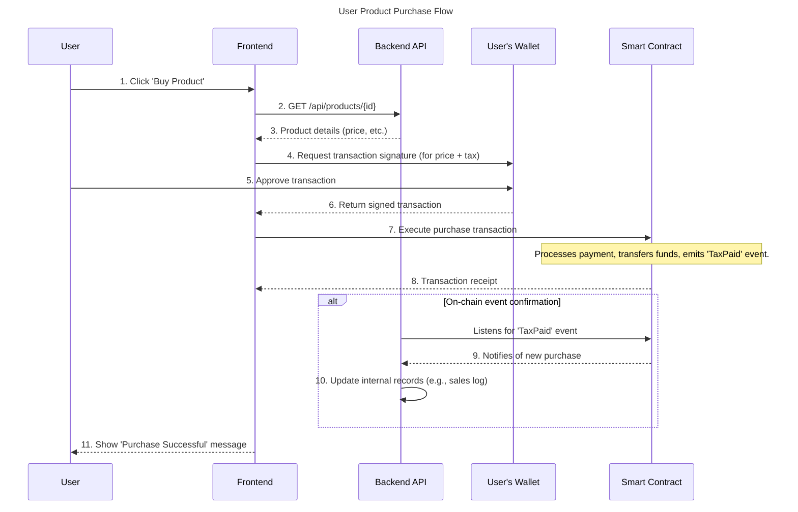

# UML Diagrams for Carbon Tax dApp

This file contains three key UML diagrams to visualize the project's architecture and interactions: a Component Diagram, a Class Diagram, and a Sequence Diagram.

---

## 1. Component Diagram

This diagram shows the high-level components of the system and how they depend on each other.

```mermaid
componentDiagram
    title System Component Diagram

    cloud "Internet" {
        node "User's Browser" {
            component [Frontend App]
        }

        node "Application Server" {
            component [Backend API]
        }

        node "Blockchain Network" {
            component [Smart Contract]
        }
    }

    database "Application DB" {
        [DB]
    }

    [Frontend App] --> [Backend API] : REST API
    [Frontend App] --> [Smart Contract] : Web3 RPC
    [Backend API] -->> [DB] : JDBC/JPA
    [Backend API] --> [Smart Contract] : Web3 RPC
```

---

## 2. Class Diagram

This diagram provides a simplified view of the key classes in the backend and the structure of the main smart contract.

```mermaid
classDiagram
    title Simplified Class Diagram

    namespace Backend_API {
        class BlockchainController {
            +fundProject(request)
            +purchaseProduct(request)
        }

        class BlockchainTransactionService {
            +processFunding(data)
            +processPurchase(data)
        }

        class Web3Service {
            -web3j
            +callContractFunction(...)
            +listenToEvents()
        }

        class Product {
            -Long id
            -String name
            -Double price
        }

        class User {
            -Long id
            -String username
            -String walletAddress
        }

        BlockchainController ..> BlockchainTransactionService : uses
        BlockchainTransactionService ..> Web3Service : uses
    }

    namespace Smart_Contract {
        class Ownable {
            +owner()
            +transferOwnership()
        }

        class Pausable {
            +paused()
            +pause()
            +unpause()
        }

        class ReentrancyGuard {
            <<modifier>> nonReentrant
        }

        class CarbonTaxSystem {
            +taxRate: uint256
            +projects: mapping
            +stakers: mapping
            +stake(): void
            +payTax(amount): void
            +addGreenProject(project): void
            +fundProject(projectId): void
            +withdrawFunds(projectId): void
        }

        CarbonTaxSystem --|> Ownable
        CarbonTaxSystem --|> Pausable
        CarbonTaxSystem --|> ReentrancyGuard
    }

    Web3Service ..> CarbonTaxSystem : interacts with
```

---

## 3. Sequence Diagram (Product Purchase Flow)

This diagram shows the step-by-step interaction between all system components when a user purchases a product.


